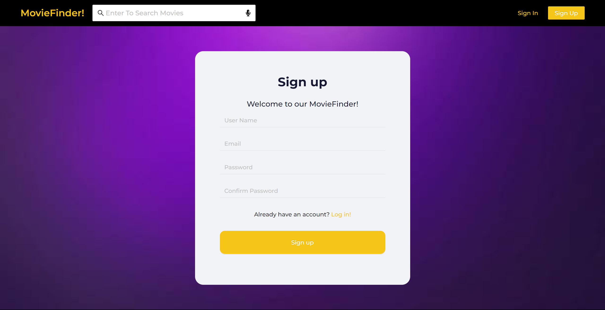
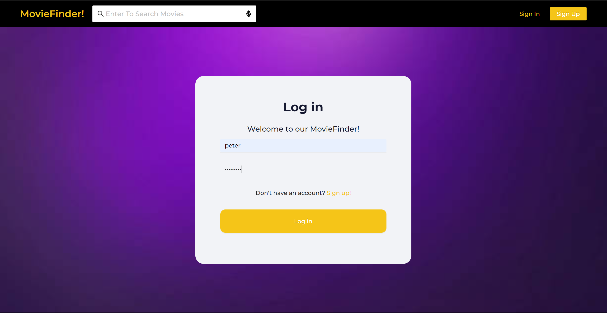
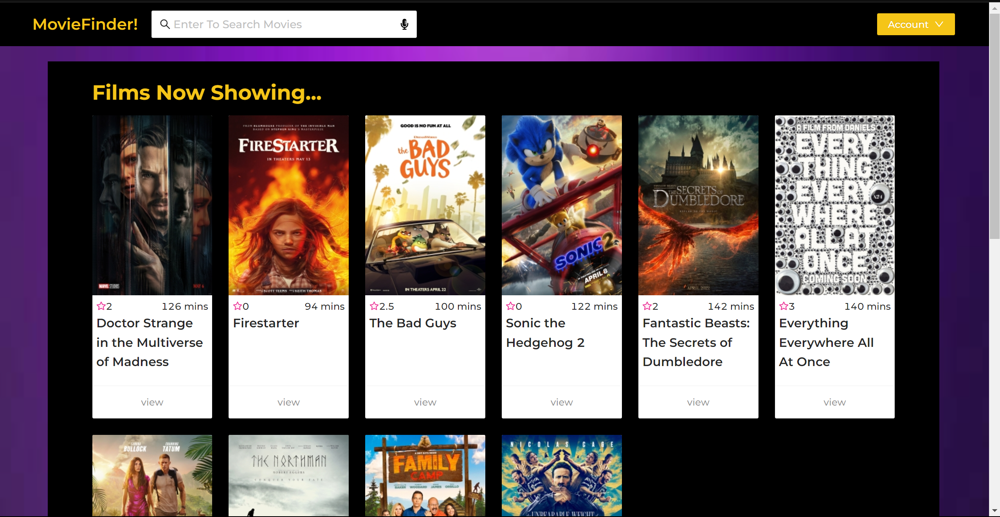
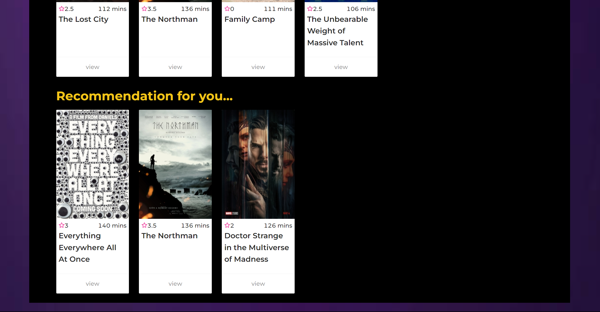
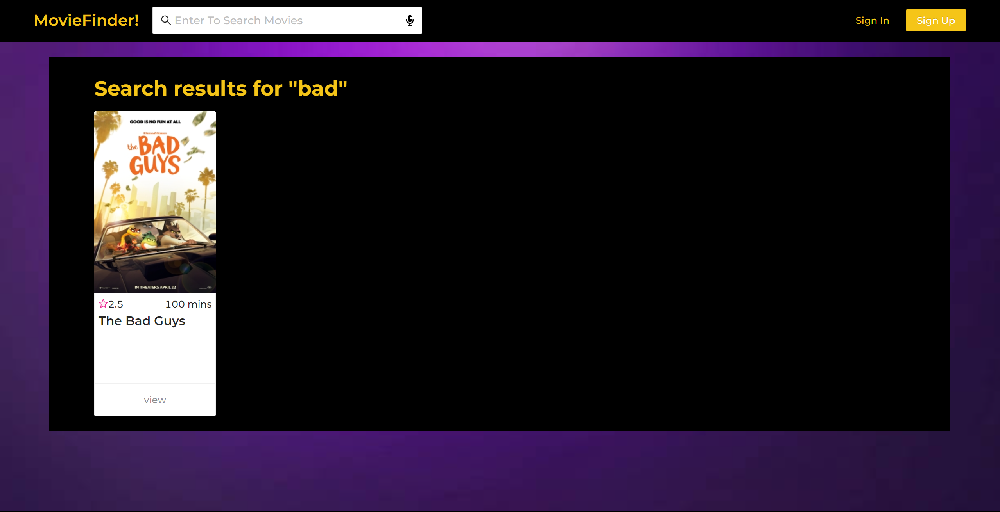
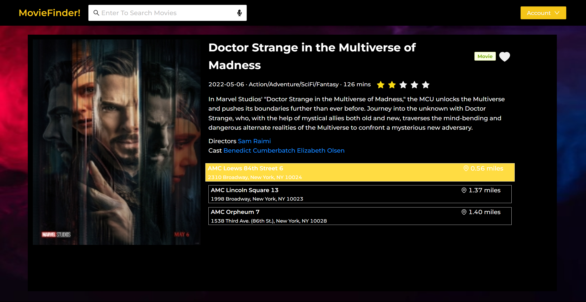
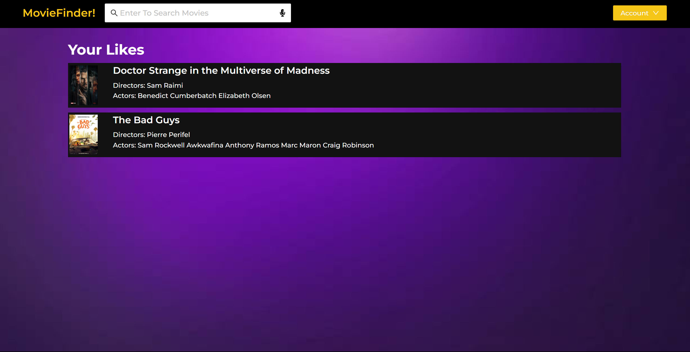
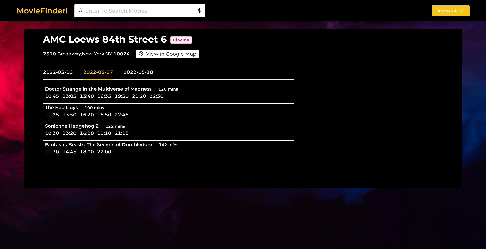
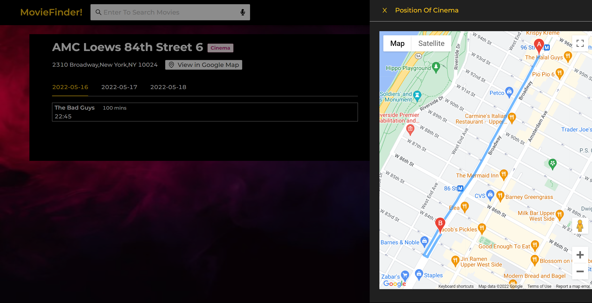

## 🎥Introduction

MovieFinder is a seamless web application that enables user to view the movies that are on showing, to elastically search the movie, to view the movie and cinema details and to navigate the user to the specific cinemas.

## 🔨 Usage

Visit our website via this [link](https://master.d23pia6jygdo3l.amplifyapp.com/). **For better experience, we recommend to use Chrome.**

You can also watch the demo video on [youtube](https://youtu.be/plJfJyFgQwI).

## ✨ Features Implemented

- Sign up and log in

Users should register an account when they visit MovieFinder! for the first time and then log in with the new account.

    
&nbsp; &nbsp;
    

-  Home Page

Users will be shown the home page no matter whether they have logged in. Anonymous users will get films now showing while logged in users will get movie recommendation additionally. Anonymous users can still search movies. However, when they click on any of the movie card to get detail information, they are forced to log in first.

    
&nbsp; &nbsp;
    

- Search

We support search function by movie name, genres, actors.

	    

- Movie Detail Page

Movie detail page lists all the information about that movie as well as 3 nearest cinemas that are showing the movie now. 

Users can mark a movie as "liked" when clicking the "heart" icon at the top right corner of the page. Movie recommendation is determined by liked movies.

	

- View liked movies

Users can also view their likes when clicking the "Likes" button below the Account menu.

	

- Cinema Detail Page

Users can view all the showtime of that cinema in future 3 days. 

Users can also click the "View on Google Map" button to get route suggestions.

    
&nbsp; &nbsp;
    

## 🎨 Clickable Prototype

View our clickable prototype on [Figma](https://www.figma.com/file/xvSejF8fkLwDiYIA7gtpev/MovieFinder?node-id=0%3A1).

## 💾 Demo Code

Limited by the thrid-party API key, we provide a demo version of code which is nearly a pure front end project except for the user authentication and search part. **The [website](https://master.d23pia6jygdo3l.amplifyapp.com/) is supported by the demo code.** You can find the code [here](https://github.com/peteryoungy/movie-finder-demo).

## 👥 Our Team 

- [Xiaoyue Chen](https://github.com/cxychristyyyyyy)

- [Meiyou Liu](https://github.com/MYMY54)

- [Yuantai Xu](https://github.com/Silverflash-Xu)

- [Yang Yu](https://github.com/peteryoungy)
